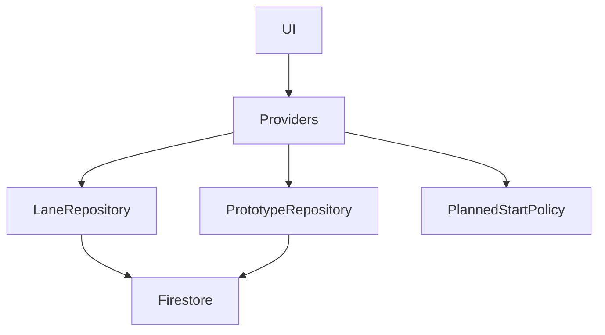
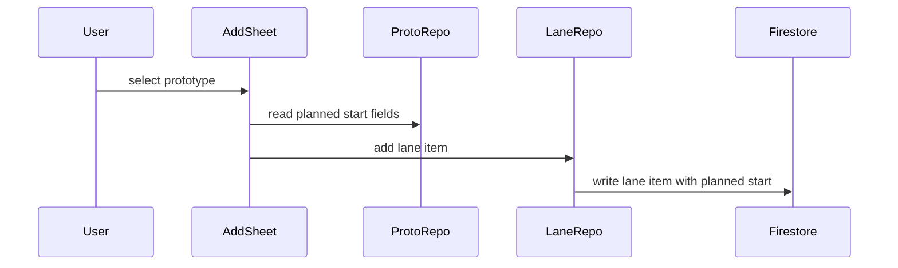
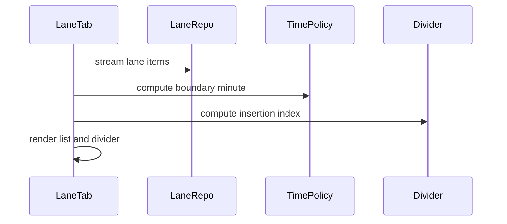
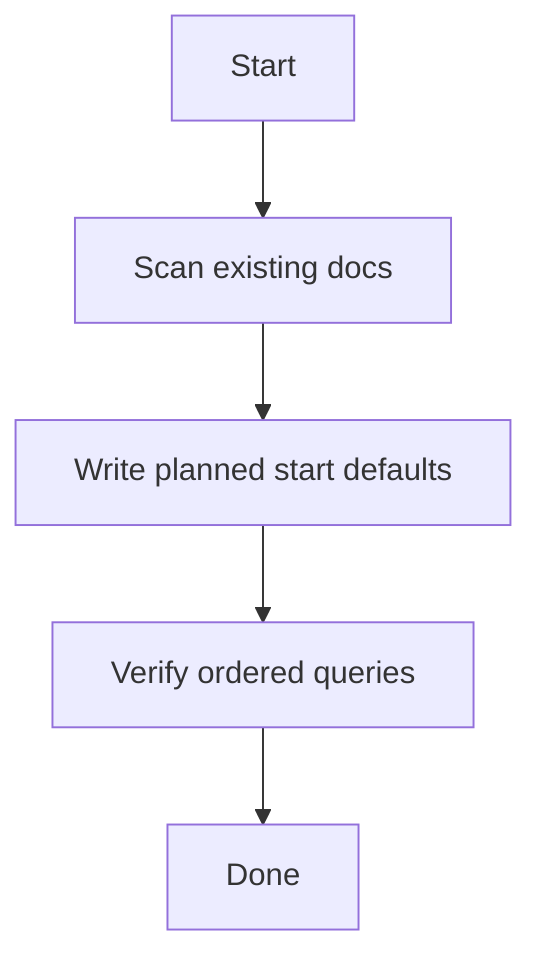

# Design Document

  

## Overview

This feature adds planned start times to prototypes and lane tasks, enabling time-based ordering and a current-time divider in the Lane tab. It preserves the existing prototype → lane → focus flow while making planning intent visible and actionable.

  

Target users use planned start times to sequence tasks during the day without changing prototype definitions. The design extends existing Flutter + Riverpod + Firestore boundaries, adds stable ordering semantics for “no planned time,” and aligns ordering with the 04:00 Asia/Tokyo day boundary.

  

### Goals

- Provide optional planned start times on prototypes and lane tasks with clear inheritance and override behavior.

- Support planned start time sorting in prototype views and lane task ordering.

- Render and maintain a current-time divider in the Lane tab that aligns with planned times.

  

### Non-Goals

- Automatic scheduling or rescheduling based on elapsed time.

- Cross-day planned start planning beyond the current day boundary.

- New external services or background workers.

  

## Requirements Traceability

  

| Requirement | Summary | Components | Interfaces | Flows |

|-------------|---------|------------|------------|-------|

| 1.1 | Prototype planned start time is optional | PrototypeRepository, PrototypeEditForm | State | — |

| 1.2 | Save planned start time on prototype | PrototypeRepository | Service, State | PrototypeUpdateFlow |

| 1.3 | Remove planned start time on prototype | PrototypeRepository | Service, State | PrototypeUpdateFlow |

| 1.4 | Allow shared planned start times on prototypes | PrototypeRepository | State | — |

| 2.1 | Inherit planned start time on lane task creation | LaneDayRepository, AddLaneTaskSheet | Service, State | LaneAddFlow |

| 2.2 | Lane task override does not update prototype | LaneDayRepository, LaneItemEditSheet | Service, State | LaneUpdateFlow |

| 2.3 | Lane task planned start time optional | LaneDayRepository, LaneItemEditSheet | State | — |

| 2.4 | Allow shared planned start times on lane tasks | LaneDayRepository | State | — |

| 3.1 | Prototype tab planned-time sorting | PrototypeListNotifier, PrototypeRepository | State | PrototypeSortFlow |

| 3.2 | Lane add drawer planned-time sorting | PrototypeStreamProvider, PrototypeRepository | State | PrototypeSortFlow |

| 3.3 | Prototype search planned-time sorting | PrototypeListNotifier | State | PrototypeSortFlow |

| 4.1 | Lane tasks ordered by planned time ascending | LaneDayRepository, LaneTimelineController | State | LaneRenderFlow |

| 4.2 | Lane ordering remains consistent | LaneDayRepository, LaneTimelineController | State | LaneRenderFlow |

| 5.1 | Ascending prototype sort places no-time first | PrototypeRepository, PlannedStartSortPolicy | State | PrototypeSortFlow |

| 5.2 | Descending prototype sort places no-time last | PrototypeRepository, PlannedStartSortPolicy | State | PrototypeSortFlow |

| 5.3 | Ascending lane sort places no-time first | LaneDayRepository, PlannedStartSortPolicy | State | LaneRenderFlow |

| 6.1 | Render current-time divider in Lane tab | LaneTimelineController, LaneCurrentTimeDivider | State | LaneRenderFlow |

| 6.2 | Scroll to current-time divider on open | LaneTimelineController | State | LaneRenderFlow |

| 6.3 | Update divider on tab switch | AppShell, LaneTimelineController | State | LaneRenderFlow |

| 6.4 | Update divider on prototype add drawer open/close | LaneTab, LaneTimelineController | State | LaneRenderFlow |

| 6.5 | Update divider on focus drawer open/close | AppShell, LaneTimelineController | State | LaneRenderFlow |

  

## Architecture

  

### Existing Architecture Analysis

- Flutter UI is organized by domain with Riverpod providers and repository/service boundaries.

- Firestore data access is centralized in repositories (`prototype_repository.dart`, `lane_repository.dart`).

- Lane ordering currently relies on `orderRank` and is streamed via `currentDayLaneItemsProvider`.

  

### Architecture Pattern & Boundary Map

**Architecture Integration**:

- Selected pattern: Repository + Provider extension (consistent with existing architecture).

- Domain/feature boundaries: `prototypes/` owns prototype metadata; `lane/` owns day-specific items; shared time policy in `utils/`.

- Existing patterns preserved: Riverpod providers, Firestore repositories, UI widgets in `widgets/`.

- New components rationale: planned-time policy and timeline controller centralize ordering and divider logic.

- Steering compliance: maintains repository/service separation and Asia/Tokyo day boundary.

  



  

### Technology Stack & Alignment

  

| Layer | Choice / Version | Role in Feature | Notes |

|-------|------------------|-----------------|-------|

| Frontend | Flutter (Dart) | UI for planned start time input, sorting, divider | Existing UI patterns reused |

| State | Riverpod | Sorting state, timeline controller state | Existing provider architecture |

| Data | Cloud Firestore | Store planned start fields and order queries | Requires composite indexes |

| Time Handling | timezone package | Boundary-based minute calculation | Uses Asia/Tokyo 04:00 boundary |

  

## System Flows

  

### LaneAddFlow



  

### LaneRenderFlow



  

## Components & Interface Contracts

  

### Component Summary

| Component | Domain/Layer | Intent | Req Coverage | Key Dependencies (P0/P1) | Contracts |

|-----------|--------------|--------|--------------|--------------------------|-----------|

| PlannedStartSortPolicy | utils | Normalize planned start time and sort keys | 5.1, 5.2, 5.3 | DayKeyResolver (P0) | State |

| PrototypeRepository (extended) | data | Persist planned start fields, provide planned-time ordering | 1.1, 1.2, 1.3, 3.1, 3.2 | Firestore (P0) | Service, State |

| PrototypeListNotifier (extended) | state | Apply global sort mode and search ordering | 3.1, 3.3, 5.1, 5.2 | PrototypeRepository (P0), AppSettings (P0) | State |

| LaneDayRepository (extended) | data | Persist planned start fields on lane items | 2.1, 2.2, 2.3, 4.1, 5.3 | Firestore (P0) | Service, State |

| LaneTimelineController | state/UI | Compute divider position and scroll target | 4.1, 6.1, 6.2, 6.3, 6.4, 6.5 | PlannedStartSortPolicy (P0) | State |

| PrototypeEditForm | UI | Collect planned start time input for prototype | 1.1, 1.2, 1.3 | PrototypeRepository (P0) | State |

| LaneItemEditSheet | UI | Edit planned start time for lane task | 2.2, 2.3 | LaneDayRepository (P0) | State |

| LaneCurrentTimeDivider | UI | Visual marker for current time | 6.1 | LaneTimelineController (P0) | State |

  

### utils

  

#### PlannedStartSortPolicy

  

| Field | Detail |

|-------|--------|

| Intent | Normalize clock time to boundary-based sort keys and flags. |

| Requirements | 5.1, 5.2, 5.3 |

  

**Responsibilities & Constraints**

- Compute `plannedStartMinute`, `plannedStartBoundaryMinute`, and `hasPlannedStart`.

- Use DayKeyResolver boundary minute (default 04:00 Tokyo).

- Ensure stable ordering for no-time items via `hasPlannedStart`.

  

**Dependencies**

- Inbound: PrototypeRepository, LaneDayRepository, LaneTimelineController — planned time normalization (P0)

- Outbound: DayKeyResolver — boundary minute calculation (P0)

  

**Contracts**: Service [ ] / API [ ] / Event [ ] / Batch [ ] / State [x]

  

##### State Management

- State model: value object `PlannedStartTime` {clockMinute, boundaryMinute, hasPlannedStart}

- Persistence & consistency: serialized into Firestore fields on write

- Concurrency strategy: deterministic conversion, no shared mutable state

  

**Implementation Notes**

- Integration: use for all write paths to Firestore

- Validation: reject clock minutes outside 0–1439

- Risks: boundary conversion errors around 00:00–03:59

  

### data

  

#### PrototypeRepository (extended)

  

| Field | Detail |

|-------|--------|

| Intent | Store planned start time on prototypes and support planned-time ordering queries. |

| Requirements | 1.1, 1.2, 1.3, 3.1, 3.2, 5.1, 5.2 |

  

**Responsibilities & Constraints**

- Persist planned start fields (`plannedStartMinute`, `plannedStartBoundaryMinute`, `hasPlannedStart`).

- Provide ordered queries for planned-time sorting (asc/desc) and default ordering.

- Normalize legacy documents to include planned start fields.

- Planned-time ordering uses `hasPlannedStart` then `plannedStartBoundaryMinute` then `nameLower` as tie-breaker.

  

**Dependencies**

- Inbound: PrototypeListNotifier, PrototypeEditForm — update and fetch (P0)

- Outbound: Firestore — storage and ordered queries (P0)

  

**Contracts**: Service [x] / API [ ] / Event [ ] / Batch [ ] / State [x]

  

##### Service Interface

```dart

abstract class PrototypeRepository {

Future<void> updatePlannedStartTime({

required String prototypeId,

required PlannedStartTime plannedStart,

});

  

Stream<List<Prototype>> watchAllSorted(PrototypeSortMode mode);

  

Future<PrototypePage> fetchPageSorted({

required PrototypeSortMode mode,

int limit = 13,

QueryDocumentSnapshot<Map<String, dynamic>>? startAfter,

});

}

```

- Preconditions: `plannedStart` is normalized via PlannedStartSortPolicy.

- Postconditions: all stored prototype docs have planned start fields present.

- Invariants: `hasPlannedStart == false` implies `plannedStartMinute` and `plannedStartBoundaryMinute` are defaulted.

  

##### State Management

- State model: `Prototype` extended with planned start fields

- Persistence & consistency: orderBy uses `hasPlannedStart` then `plannedStartBoundaryMinute` then `nameLower`

- Concurrency strategy: last-write-wins on `updatedAt`

  

**Implementation Notes**

- Integration: add composite indexes for planned-time ordering (`archived`, `hasPlannedStart`, `plannedStartBoundaryMinute`, `nameLower`)

- Validation: enforce presence of planned fields to avoid `orderBy` filtering

- Risks: search sorting is limited to the fetched result set; planned-time sort in search applies a client-side partial sort on each page

  

#### LaneDayRepository (extended)

  

| Field | Detail |

|-------|--------|

| Intent | Create and update lane items with planned start fields and ordered streams. |

| Requirements | 2.1, 2.2, 2.3, 4.1, 5.3 |

  

**Responsibilities & Constraints**

- Copy planned start fields from prototype on lane add.

- Update planned start fields on lane item edit without touching prototype.

- Stream lane items ordered by planned time ascending.

- Lane ordering uses `hasPlannedStart` then `plannedStartBoundaryMinute` then `orderRank` as tie-breaker.

  

**Dependencies**

- Inbound: AddLaneTaskSheet, LaneItemEditSheet, LaneTimelineController (P0)

- Outbound: Firestore (P0)

  

**Contracts**: Service [x] / API [ ] / Event [ ] / Batch [ ] / State [x]

  

##### Service Interface

```dart

abstract class LaneDayRepository {

Future<void> updatePlannedStartTime({

required String dayKey,

required String laneTaskId,

required PlannedStartTime plannedStart,

});

  

Stream<List<LaneItem>> watchDaySorted(String dayKey);

}

```

- Preconditions: lane task exists for `laneTaskId`.

- Postconditions: lane item stores planned start fields and is re-ordered by the query.

- Invariants: lane ordering uses `hasPlannedStart` then `plannedStartBoundaryMinute` then `orderRank`.

  

##### State Management

- State model: `LaneItem` extended with planned start fields

- Persistence & consistency: ordered stream uses `hasPlannedStart`, `plannedStartBoundaryMinute`, then `orderRank`

- Concurrency strategy: Firestore ordered stream delivers stable ordering

  

**Implementation Notes**

- Integration: add composite indexes for lane item ordering (`hasPlannedStart`, `plannedStartBoundaryMinute`, `orderRank`)

- Validation: ensure planned fields are present for all lane items

- Risks: lane items without planned times must remain visible in ordered stream

  

### state and UI

  

#### Global Sort Mode (AppSettings)

- Intent: Provide a single global sort mode shared across Prototype tab, add drawer, and search.

- Requirements: 3.1, 3.2, 3.3

- Implementation Notes: Persist in `AppSettings` and expose via a provider to all screens.

  

#### LaneTimelineController

  

| Field | Detail |

|-------|--------|

| Intent | Compute divider placement and scroll target in Lane tab. |

| Requirements | 4.1, 6.1, 6.2, 6.3, 6.4, 6.5 |

  

**Responsibilities & Constraints**

- Compute current boundary minute using DayKeyResolver.

- Determine divider insertion index after no-time items and before the first planned time later than now.

- Trigger scroll to divider on lane tab open, tab switch, and drawer open/close events.

  

**Dependencies**

- Inbound: LaneTab, AppShell (P0)

- Outbound: PlannedStartSortPolicy, currentDayLaneItemsProvider (P0)

  

**Contracts**: Service [ ] / API [ ] / Event [ ] / Batch [ ] / State [x]

  

##### State Management

- State model: `LaneTimelineState { dividerIndex, currentBoundaryMinute }`

- Persistence & consistency: derived from providers, no persistence

- Concurrency strategy: recompute on UI lifecycle events and provider updates

  

**Implementation Notes**

- Integration: LaneTab uses a ScrollController keyed to the divider position

- Validation: handle empty lists or no planned times gracefully

- Risks: rapid UI state changes could trigger redundant scroll updates

  

#### PrototypeEditForm (summary)

- Intent: Collect optional planned start time and pass normalized data to repository.

- Requirements: 1.1, 1.2, 1.3

- Implementation Notes: Uses TimeInputFormatter for HH:mm entry and clear action.

  

#### LaneItemEditSheet (summary)

- Intent: Override planned start time on a lane task without changing prototype.

- Requirements: 2.2, 2.3

- Implementation Notes: Presents inherited value with override/clear actions.

  

## Data Models

  

### Domain Model

- **Value Object**: `PlannedStartTime`

- `clockMinute`: int (0–1439)

- `boundaryMinute`: int (0–1439)

- `hasPlannedStart`: bool

- **Entities**:

- `Prototype` extends with planned start fields.

- `LaneItem` extends with planned start fields.

  

### Logical Data Model

  

**Structure Definition**:

- `prototypes/{prototypeId}`

- `plannedStartMinute`: int

- `plannedStartBoundaryMinute`: int

- `hasPlannedStart`: bool

- `laneDays/{dayKey}/items/{laneTaskId}`

- `plannedStartMinute`: int

- `plannedStartBoundaryMinute`: int

- `hasPlannedStart`: bool

  

**Consistency & Integrity**:

- Planned start fields are required (existence) to satisfy Firestore `orderBy` behavior.

- `hasPlannedStart` controls ordering of no-time items; `plannedStartBoundaryMinute` is ignored when `hasPlannedStart` is false.

- `plannedStartBoundaryMinute` is derived from `clockMinute` and DayKeyResolver boundary minute.

  

### Physical Data Model

**Document Store (Firestore)**

- Composite indexes required:

- `prototypes`: `archived` + `hasPlannedStart` + `plannedStartBoundaryMinute` + `nameLower` (asc/desc variants)

- `laneDays/{dayKey}/items`: `hasPlannedStart` + `plannedStartBoundaryMinute` + `orderRank`

  

### Data Contracts & Integration

- No external APIs or events introduced.

- Planned-time sort in prototype search is satisfied via per-page client-side ordering; full cross-page ordering is out of scope for this iteration.

  

## Error Handling

  

### Error Strategy

- Validate planned time input on the client before repository updates.

- Surface Firestore update failures as non-blocking UI errors with retry options.

  

### Error Categories and Responses

- **User Errors**: Invalid time input → inline validation and clear action.

- **System Errors**: Firestore update failures → snack bar with retry.

- **Business Logic Errors**: None introduced beyond validation.

  

### Monitoring

- Reuse existing error logging patterns for repository exceptions.

  

## Testing Strategy

  

- Unit Tests: planned time normalization and boundary conversion.

- Unit Tests: lane divider placement logic with edge cases (no planned times, all before/after now, before 04:00).

- Integration Tests: prototype planned time save/remove persists to Firestore.

- Integration Tests: lane task inherits and overrides planned time correctly.

- UI Tests: lane list renders divider and scrolls to it on open.

  

## Security Considerations

- No new authentication or authorization paths; reuse existing Firestore security rules.

  

## Performance & Scalability

- Ordered queries require composite indexes; keep ordering fields minimal to avoid index bloat.

  

## Migration Strategy

  



  

- Add a normalization step similar to existing legacy field normalization to backfill planned start fields.

- Run on repository initialization; skip if fields already present.

  

## 追記: 秒精度の予定開始時刻

  

この追記は、本ドキュメント内の「分」単位の記述よりも優先される。

  

### 表示と入力

- 予定開始時刻の表示は `HH:mm:ss` 形式で行う。

- 入力は `HHmm` または `HHmmss` を受け付ける。

- 秒が省略された場合は `00` 秒として解釈する。

  

### 正規化と値オブジェクト

- 正規化単位は秒とし、`0〜86399` の範囲で扱う。

- `PlannedStartTime` は `clockSecond`, `boundarySecond`, `hasPlannedStart` を保持する。

- 境界時刻（Asia/Tokyo 04:00）に基づく並び替えは秒単位で行う。

  

### データモデル

- Firestore には `plannedStartSecond`, `plannedStartBoundarySecond`, `hasPlannedStart` を保存する。

- 予定開始時刻が未設定の場合でも、並び替えのために各フィールドは必ず存在させる。

  

### 並び替え

- プロトタイプとレーン項目の並び替えは `hasPlannedStart` → `plannedStartBoundarySecond` の順で安定させる。